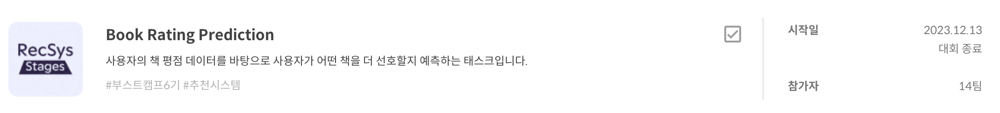
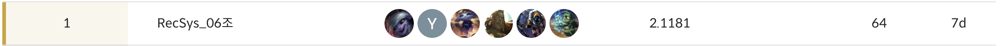
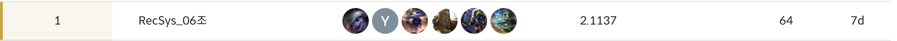
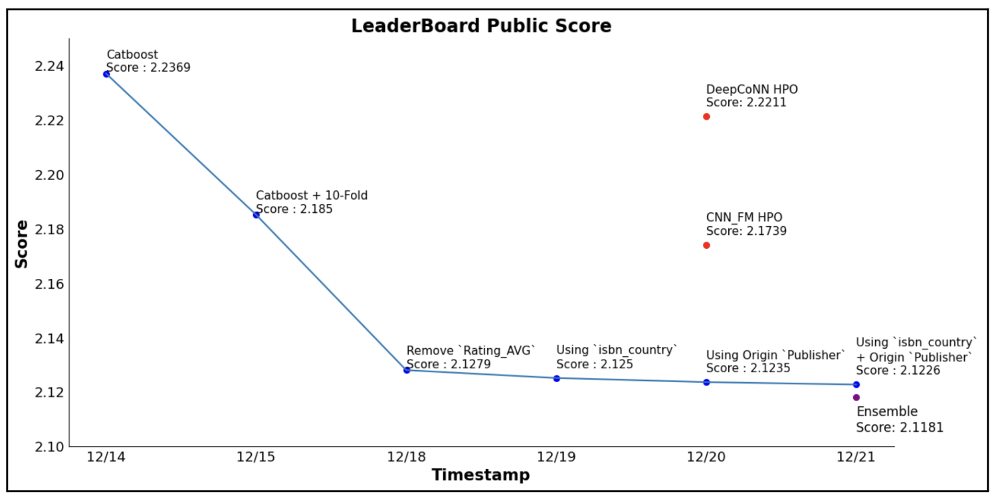

# Book Rating Prediction

## 📌 프로젝트 개요

 책과 관련된 정보와  소비자의 정보, 그리고  소비자가 실제로 부여한 평점을 활용하여 **사용자가 주어진 책에 대해 얼마나 평점을 부여**할지에 대해 예측합니다.

해당 경진대회는 소비자들의 책 구매 결정에 대한 도움을 주기 위한 **개인화된 상품 추천 대회**입니다.

## 🥇 프로젝트 결과

### Public

### Private

## 📋 프로젝트 수행 절차 및 방법

### EDA
- 전체 텍스트 데이터 처리
- 사용자 연령대 분석
- 도서 ISBN 처리
- 도서 저자 처리
- 출판 년도 처리
- 출판사 처리
- 이미지 URL 처리
- 도서 카테고리 처리
- 책 요약 정보 처리

### 모델링
- 모든 Feature를 Categorization하여 사용하였습니다.
- Categorical features에 효과적인 Gradient Boosting Library인 `Catboost`를 활용했습니다.
- HPO(Hyper Parameter Optimization)는 `Optuna`를 활용했습니다.

#### Catboost 모델링
- `CatBoostPruningCallback`을 활용하여 HPO 도중 불필요한 실험을 중단하는 기법을 적용했습니다. (GPU 지원 x)
- 일반적인 Regression 문제에선 연속형 Label에 대해 `Starfield K-Fold`를 지원하지 않지만, 본 프로젝트의 Rating이 이산형으로 되어있어 사용했습니다.
- 특히, Rating 값의 분포 차이가 커서 `Starfield K-Fold`하는 것이 좋다고 판단했습니다.

#### CNN_FM, DeepCoNN 모델링
- 성능 향상을 위해 비정형 데이터(이미지, 텍스트)를 활용하는 `CNN_FM`과 `DeepCoNN` 모델을 학습하였습니다.
- 추후에, `Catboost`모델과 앙상블 진행했습니다.

### 모델 평가 및 개선
- Optuna를 활용하여 HPO 수행하였습니다.
- 다양한 Feature Engineering을 수행하여 모델의 성능을 향상시켰습니다.

## 팀원
<table align="center">
  <tr height="155px">
    <td align="center" width="150px">
      
    </td>
    <td align="center" width="150px">
      
    </td>
    <td align="center" width="150px">
      
    </td>
    <td align="center" width="150px">
      
    </td>
    <td align="center" width="150px">
      
    </td>
  </tr>
  <tr height="80px">
    <td align="center" width="150px">
      <a href="https://github.com/kwanok">노관옥</a>
    </td>
    <td align="center" width="150px">
      <a href="https://github.com/power16one5">박경원</a>
    </td>
    <td align="center" width="150px">
      <a href="https://github.com/seokulee">이석규</a>
    </td>
    <td align="center" width="150px">
      <a href="https://github.com/jw0112">이진원</a>
    </td>
    <td align="center" width="150px">
      <a href="https://github.com/ksj1368">장성준</a>
    </td>
  </tr>
</table>
&nbsp;

## 📚 Report & Presentation
[Wrap-up Report (PDF)](./[Boostcamp%20AI%20Tech]%20Level1_Wrap-up_Report%20-%20RecSys_06조.pdf)

프로젝트 수행 절차, 방법, 결과, 최종 평가, 팀원별 회고는 wrap-up report에서 더 자세히 확인하실 수 있습니다.

[Presentation (PPT)](./[Boostcamp%20AI%20Tech]%20Level1_Book_Rating_Prediction%20-%20RecSys_06조.pdf)

프로젝트 결과 발표 자료입니다.
